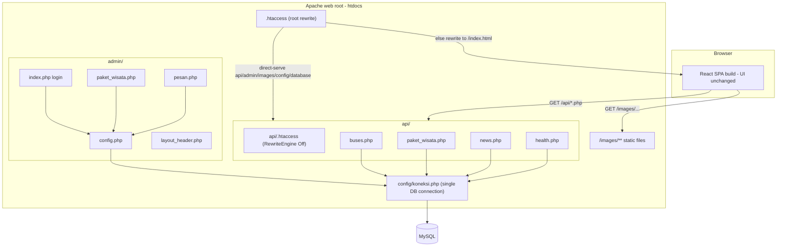

# Design Document

## Overview

This design fixes the backend, API, database, admin, image-path, and deployment concerns of the **Surya Tour Trans** application (`c:\xampp\htdocs\bus_pariwisata`, deployed on InfinityFree at `https://testingbuspariwisata.infinityfreeapp.com`). The application is a React single-page frontend served from the web root, a set of PHP endpoints under `api/`, a PHP admin panel under `admin/`, and a MySQL database.

The central defect is an image-path mismatch: stored/returned paths sometimes point at `frontend/assets/images/...` or carry host/Windows prefixes, while the only public web path that resolves to real files in production is `/images/...`. The fix is a deterministic path-normalization function applied uniformly across the bus and package endpoints, plus a verified root `images/` folder, plus rewrite rules that serve `/images/...` directly.

Secondary work hardens the `paket_wisata` endpoint field shape, makes the `news` endpoint always return JSON with a consistent `ringkas` field (deriving it when the column is absent), confirms the admin login + content pages follow the existing admin style, keeps the database connection centralized in `config/koneksi.php`, fixes the root `.htaccess` direct-serve ordering, and makes the frontend API base URL hostname-aware. Deployment docs are updated so the `/images/` requirement is unmissable.

**Hard constraint (carried from requirements):** The frontend UI design MUST NOT change. Layout, color scheme, card style, navbar, animations, and typography are out of scope. The ONLY permitted frontend change is the non-visual API base URL in `frontend/src/config/api.js`. The admin panel keeps its existing visual style; no admin redesign.

### Grounding Summary (verified against the current codebase)

- **Root `images/` already exists and is populated** with `bus1`..`bus11` and `destinasi` subfolders (plus a few loose files). `frontend/assets/images/` contains the same `bus1`..`bus11` and `destinasi` subfolders. Requirement 1 is therefore an *idempotent verify-and-sync of missing files only* — never a destructive move or delete.
- **`api/buses.php`** already defines `normalizeImagePath()`, but its prefix list is `['/frontend/assets/images/','frontend/assets/images/','/assets/images/','assets/images/']` and it strips a trailing `images/` separately. The target spec (Requirement 2.4) requires the list to also include `/images/` and `images/` and to use one unified "strip segment and everything before it" rule.
- **`api/paket_wisata.php`** already queries `paket_wisata` (not `bus`) and shapes fields via `formatPaket()`, but returns `gambar` raw (`(string)($row['gambar'] ?? '')`) without normalization.
- **`api/news.php`** queries `slug`/`status` columns, filters `status = 'publish'`, orders by `created_at DESC` only, returns HTTP 500 on a missing table, and has no `ringkas` field.
- **`admin/index.php`** already authenticates against `admin_users` using `password_verify`; **`database/setup.sql`** seeds the bcrypt hash for `admin123`.
- **`config/koneksi.php`** is centralized with env-var support and manual fallbacks; **`admin/config.php`** already `require_once`s it.
- **`.htaccess`** already has the rewrite block but the direct-serve folder rule omits the spec's exact form/order; **`api/.htaccess`** already sets `RewriteEngine Off`.
- **`frontend/src/config/api.js`** currently selects the base URL by `NODE_ENV` rather than `window.location.hostname`.

## Architecture

The system is a three-tier application deployed under a single web root. The design changes are confined to the API layer, the admin layer, configuration, and the static image filesystem — never the rendered frontend UI.



### Request routing principle

`.htaccess` at the web root must (1) serve any existing physical file/dir directly, (2) serve anything under `api/`, `admin/`, `images/`, `config/`, `database/` directly, and (3) rewrite everything else to `/index.html` for React Router. `api/.htaccess` disables rewriting entirely so PHP endpoints are never forwarded to the SPA.

### Image-path single source of truth

Every endpoint that returns an image path delegates to one `normalizeImagePath()` function with identical behavior. The function is the single source of truth for producing a `Canonical_Image_Path` (`/images/<subpath>`). It is duplicated as an identical implementation in `api/buses.php` and `api/paket_wisata.php` (PHP has no shared autoloader here); the design specifies one canonical algorithm both copies must match exactly. The function never depends on the database, the filesystem, or the request host, so it is deterministic and pure.

## Components and Interfaces

### 1. Image_Normalizer — `normalizeImagePath($path): string`

Lives in `api/buses.php` and `api/paket_wisata.php` (identical implementation). Pure, deterministic, no I/O.

**Signature:** `function normalizeImagePath(?string $path): string`

**Algorithm (canonical, must match Requirement 2):**
1. If `$path` is null/empty, return `''`.
2. Trim whitespace, then replace every backslash `\` with forward slash `/`.
3. Remove a leading protocol-and-host prefix matching `^https?://[^/]+/` (strip scheme, host, and the slash that follows the host).
4. Scan for the first occurrence of any of these segments, in this order, and if found, discard that segment **and everything before it**:
   `/frontend/assets/images/`, `frontend/assets/images/`, `/assets/images/`, `assets/images/`, `/images/`, `images/`.
5. Strip any remaining leading `/` characters from the residual relative path.
6. Return `'/images/' . <residual>`.

**Notes:**
- Because `/images/` and `images/` are in the strip list, a path that already begins with `/images/...` collapses to its tail and is re-prefixed once — guaranteeing exactly one `/images/` prefix (idempotence).
- Step 3 also covers the case where a host is followed immediately by `/images/...`.
- The function never emits `frontend/assets/images`, `localhost`, `C:/xampp`, or `../frontend` (Requirement 2.9), because step 4 always discards everything up to and including the recognized images segment, and step 3 removes hosts.

**Output contract (`Canonical_Image_Path`):** forward slashes only, exactly one leading `/`, begins with `/images/`, no protocol, no host, no `frontend/assets/` segment.

### 2. Buses_API — `api/buses.php`

Behavior is preserved; only the normalizer body is brought into line with Requirement 2.4 (add `/images/`,`images/` to the strip list and use the unified "strip segment and preceding" rule), and normalization continues to be applied to `gambar`, `gambar_utama`, and every `bus_images.path`.

- Dynamic column detection (`SHOW COLUMNS FROM bus`) is retained for `gambar_utama`/`gambar`, `tipe`, `deskripsi`, `fasilitas`.
- For each record: `gambar` and `gambar_utama` are set to the **same** `normalizeImagePath()` result (Requirement 2.8).
- Each `bus_images` entry path is normalized (Requirement 2.7).
- Response envelope: `{ status, message, data }`. List mode returns `data` as an array; `?id=` mode returns a single object or 404.

### 3. Paket_API — `api/paket_wisata.php`

`formatPaket()` is updated to normalize `gambar` and to keep the exact field set from Requirement 3.2.

- `formatPaket($row)` returns: `id`, `judul`, `badge`, `kategori`, `durasi`, `harga`, `harga_fmt`, `deskripsi`, `gambar` (normalized to `/images/destinasi/<file>`), `status`, `urutan`, `created_at`.
- It MUST NOT return `nama_bus`, `tipe`, `kapasitas`, or `harga_sewa` (Requirement 3.3) — confirmed: `formatPaket()` does not include them.
- `gambar` is passed through `normalizeImagePath()` (Requirement 3.5). Stored values are already `/images/destinasi/...`; normalization is idempotent and keeps them canonical.
- `harga_fmt` = `'Rp. ' . number_format((int)$harga, 0, ',', '.')` → e.g. `Rp. 2.200.000` (Requirement 3.6).
- The "all active" list query is `SELECT ... FROM paket_wisata WHERE status = 'aktif' ORDER BY urutan ASC, id ASC` (Requirement 3.4). The current code uses `SELECT *`; the design narrows it to the explicit column list to match the requirement while keeping the same filter/order. `normalizeImagePath()` is defined inside `paket_wisata.php` as an identical copy of the canonical algorithm.

### 4. News_API — `api/news.php` (ringkas fallback — Requirement 4)

The endpoint is reworked to always return JSON and always include a `ringkas` field per record, **without** forcing any migration or altering the `news` table.

**Column-presence detection:** Before building the list query, the endpoint detects whether the `news` table has a `ringkas` column. Detection uses a safe metadata probe rather than assuming the column:

```
hasColumn(conn, 'news', 'ringkas'):
    res = mysqli_query(conn, "SHOW COLUMNS FROM news LIKE 'ringkas'")
    return res !== false AND mysqli_num_rows(res) > 0
```

**Table-presence detection** (so a missing table yields empty data, not 500 — Requirement 4.8):

```
tableExists(conn, 'news'):
    res = mysqli_query(conn, "SHOW TABLES LIKE 'news'")
    return res !== false AND mysqli_num_rows(res) > 0
```

**Query construction:**
- If `news` table does not exist → return `{ status:'success', message:'', data: [] }`.
- If `ringkas` column exists → `SELECT id, judul, ringkas, konten, gambar, created_at FROM news ORDER BY created_at DESC, id DESC`.
- If `ringkas` column absent → `SELECT id, judul, konten, gambar, created_at FROM news ORDER BY created_at DESC, id DESC`, and derive `ringkas` at runtime.

> Note: the current `news` table includes a `status` column with values `publish`/`draft`. The endpoint continues to read what is present, but the agreed Requirement 4 query shape orders by `created_at DESC, id DESC` and centers on `id, judul, (ringkas|derived), konten, gambar, created_at`. Status filtering is preserved only if it does not conflict with always-return-JSON; the list path must never 404/500 on absence.

**Ringkas derivation (when column absent):**

```
deriveRingkas(konten):
    text = strip_tags(konten)
    text = collapse_whitespace(trim(text))          // optional tidy
    if mb_strlen(text) <= 180: return text
    return mb_substr(text, 0, 180) [trimmed to a word boundary near 150-180] + '…'
```

**`formatNews($row, $hasRingkasColumn)`** always emits a `ringkas` key:
- If `$hasRingkasColumn` and `$row['ringkas']` is non-null → use it as-is.
- Else → `deriveRingkas($row['konten'])`.

**Response envelope:** `{ status, message, data }`; `data` is an array for the list path. `status = 'success'` on completion (Requirement 4.9). Single-record paths (`?id=`, `?slug=`) keep working and also include `ringkas`.

### 5. Health_API — `api/health.php`

Unchanged in behavior. It reports `database: 'connected'` when the connection is live and reports per-table booleans for `bus, bus_images, price_list, paket_wisata, admin_users, news, pesan_masuk` (Requirement 11.6). No redesign needed.

### 6. Admin_Login — `admin/index.php` (Requirement 5)

Already correct against the requirement; design confirms and preserves:
- Authenticates against `admin_users (id, nama, username, password, created_at)`.
- Verifies with `password_verify($input, $row['password'])`.
- On failure (unknown user or false verify) → shows the inline authentication error ("Username atau password salah.").
- On success → sets `$_SESSION['admin_id'|'admin_nama'|'admin_user']` and redirects to `dashboard.php`.
- Visual style (Tailwind CDN login card) is kept exactly as-is.

### 7. Admin content pages — `admin/paket_wisata.php`, `admin/pesan.php`, `admin/layout_header.php` (Requirement 6)

Already present and matching the existing admin style; design confirms and preserves:
- `admin/paket_wisata.php`: lists `paket_wisata`, supports add/edit/delete, status `aktif|nonaktif`, and an image path text field. Uses the shared sidebar/layout.
- `admin/pesan.php`: lists `pesan_masuk`, marks read, deletes, defends against a missing `is_read` column via `SHOW COLUMNS`.
- `admin/layout_header.php`: sidebar links for Dashboard, Armada, Paket Wisata, Price List, Berita (News), Pesan Masuk, plus "Lihat Website" and Logout. No admin redesign.

### 8. DB_Config — `config/koneksi.php` (Requirement 7)

Already the single connection point; design confirms and preserves:
- Reads `DB_HOST/DB_USER/DB_PASS/DB_NAME` from env when present, else uses XAMPP defaults with documented InfinityFree/VPS fallbacks (commented blocks).
- Sets `utf8mb4`. On failure, sets `$conn = false` so each API handler returns a controlled 503 instead of leaking errors.
- `admin/config.php` obtains its connection only via `require_once __DIR__ . '/../config/koneksi.php'` and defines no duplicate credentials.

### 9. Frontend_Api_Config — `frontend/src/config/api.js` (Requirement 9)

The only permitted frontend change. Replace the `NODE_ENV` selection with a hostname-aware selection (non-visual):

```js
const API_BASE =
  process.env.REACT_APP_API_BASE_URL ||
  (window.location.hostname === 'localhost'
    ? 'http://localhost/bus_pariwisata/api'
    : '/api');

export default API_BASE;
```

No UI markup, styling, or component behavior changes. If the build system differs, the same selection logic is adapted to it (Requirement 9.2).

### 10. Apache configuration (Requirement 8)

**Root `.htaccess`** — preserve the exact Task 8 directive order from the requirements (do not reorder):

```
RewriteEngine On

RewriteCond %{REQUEST_FILENAME} -f [OR]
RewriteCond %{REQUEST_FILENAME} -d
RewriteRule ^ - [L]

RewriteRule ^(api|admin|images|config|database)/ - [L]

RewriteRule . /index.html [L]
```

The current file uses the folder order `(api|admin|config|database|images)`; the design updates it to the requirement's exact `(api|admin|images|config|database)` token order and keeps the surrounding directives (Options -Indexes, MIME, expires, file guards). `api/.htaccess` retains `RewriteEngine Off` and, if the host rejects extra directives, only that directive remains (Requirement 8.6).

### 11. Local image structure (Requirement 1)

An idempotent verify-and-sync, never destructive:
- For every file under `frontend/assets/images/<subpath>`, ensure an identical file exists at `images/<subpath>`.
- Never delete or move from `frontend/assets/images/`; it is preserved (Requirement 1.2).
- If the destination already exists with identical content, leave it untouched (Requirement 1.4).
- Result: `images/bus1`..`images/bus11` and `images/destinasi` mirror their `frontend/assets/images/` counterparts (Requirement 1.3). Both roots already exist; the task only fills gaps.

## Data Models

No schema changes are introduced by this feature. The relevant existing tables (from `database/setup.sql`):

**bus**: `id, nama_bus, tipe, kapasitas, harga_sewa, gambar_utama, deskripsi, fasilitas_json, created_at`
**bus_images**: `id, bus_id, path, label, urutan`
**paket_wisata**: `id, judul, badge, kategori, durasi, harga, deskripsi, gambar, status('aktif'|'nonaktif'), urutan, created_at, updated_at`
**news**: `id, judul, slug, konten, gambar, status('publish'|'draft'), created_at, updated_at` — note: `ringkas` is **optional**; the API derives it when absent and never adds it via migration.
**admin_users**: `id, nama, username, password (bcrypt), created_at`
**pesan_masuk**: `id, nama, email, judul, pesan, is_read, created_at`

### API response shapes (output models)

**Bus record (Buses_API):**
```json
{
  "id": 1,
  "nama_bus": "Pratama Trans",
  "tipe": "big_bus",
  "kapasitas": 45,
  "harga_sewa": 4500000,
  "gambar": "/images/bus1/bu1.jpeg",
  "gambar_utama": "/images/bus1/bu1.jpeg",
  "deskripsi": "...",
  "fasilitas": ["Seat 3-2", "Toilet"],
  "images": [{ "path": "/images/bus1/bu1.jpeg", "label": "Eksterior Bus", "urutan": 0 }]
}
```

**Package record (Paket_API):**
```json
{
  "id": 1, "judul": "Bandung", "badge": "PAKET 1 HARI", "kategori": "1 Hari",
  "durasi": "1 Hari", "harga": 2200000, "harga_fmt": "Rp. 2.200.000",
  "deskripsi": "...", "gambar": "/images/destinasi/bandung.jpeg",
  "status": "aktif", "urutan": 1, "created_at": "..."
}
```

**News record (News_API):** always includes `ringkas`.
```json
{
  "id": 1, "judul": "...", "ringkas": "first ~150-180 chars of plain text...",
  "konten": "<p>full html...</p>", "gambar": "/images/...", "created_at": "..."
}
```

**Standard envelope:** `{ "status": "success|error", "message": "", "data": [] | {} }`.

## Correctness Properties

*A property is a characteristic or behavior that should hold true across all valid executions of a system — essentially, a formal statement about what the system should do. Properties serve as the bridge between human-readable specifications and machine-verifiable correctness guarantees.*

This feature is suitable for property-based testing (PBT) because its core changes are **pure functions over large input spaces**: the image-path normalizer (arbitrary path strings), the news `ringkas` derivation (arbitrary HTML/text), the rupiah formatter (arbitrary integers), and the API record-shaping functions (arbitrary rows). Infrastructure, Apache config, admin UI rendering, deployment docs, and live end-to-end checks are validated with integration/smoke/example tests instead (see Testing Strategy).

The correctness statements below were consolidated during prework reflection to remove redundancy (e.g. the several normalizer output-shape criteria collapse into one canonical-shape statement; the news ringkas criteria collapse into one comprehensive statement).

### Property 1: Normalizer always produces a canonical image path

*For any* input string `p`, `normalizeImagePath(p)` returns a string that begins with exactly one `/images/` prefix, contains only forward slashes, has a single leading slash (never `/images//`), and contains no protocol or host segment.

**Validates: Requirements 2.1, 2.3, 2.5, 2.6**

### Property 2: Normalizer output is clean (no backslashes, no forbidden prefixes)

*For any* input string `p` — including adversarial inputs that embed `\`, `https://host/`, `frontend/assets/images/`, `localhost`, `C:/xampp`, or `../frontend` before a recognized images segment — `normalizeImagePath(p)` returns a string containing no backslash and none of the substrings `frontend/assets/images`, `localhost`, `C:/xampp`, or `../frontend`.

**Validates: Requirements 2.2, 2.9**

### Property 3: Normalizer strips to the canonical tail

*For any* relative tail `t` (a path with no leading slash and no images segment) and *for any* recognized images segment `s` ∈ {`/frontend/assets/images/`, `frontend/assets/images/`, `/assets/images/`, `assets/images/`, `/images/`, `images/`} and *for any* arbitrary prefix garbage `g`, `normalizeImagePath(g + s + t)` equals `'/images/' + t`.

**Validates: Requirements 2.4**

### Property 4: Normalizer is idempotent

*For any* input string `p`, `normalizeImagePath(normalizeImagePath(p))` equals `normalizeImagePath(p)`.

**Validates: Requirements 2.4, 2.6**

### Property 5: Bus API emits canonical, consistent image fields

*For any* generated bus row and any set of associated `bus_images` rows, the Buses_API record sets `gambar` and `gambar_utama` to the same value, and every emitted image value (`gambar`, `gambar_utama`, and each `images[].path`) is a Canonical_Image_Path beginning with `/images/`.

**Validates: Requirements 2.7, 2.8**

### Property 6: Package record has the correct shape with a canonical image

*For any* generated `paket_wisata` row (even one carrying extra bus-like keys), `formatPaket(row)` returns an object that contains exactly the keys `id, judul, badge, kategori, durasi, harga, harga_fmt, deskripsi, gambar, status, urutan, created_at`, contains none of the keys `nama_bus, tipe, kapasitas, harga_sewa`, and whose `gambar` is a Canonical_Image_Path beginning with `/images/`.

**Validates: Requirements 3.2, 3.3, 3.5**

### Property 7: Rupiah formatting is correct

*For any* non-negative integer `n`, `harga_fmt` equals `'Rp. ' + number_format(n, 0, ',', '.')` — i.e. the literal prefix `Rp. ` followed by `n` rendered with `.` as the thousands separator and no decimal part.

**Validates: Requirements 3.6**

### Property 8: News records always carry a correct `ringkas`

*For any* generated news row, the News_API record always includes a string `ringkas` field, and: when the `ringkas` column is present, `ringkas` equals the stored column value; when the `ringkas` column is absent, `ringkas` equals `strip_tags(konten)` truncated to at most ~180 characters and contains no HTML tags.

**Validates: Requirements 4.3, 4.4, 4.5**

## Error Handling

The endpoints favor controlled JSON responses over fatal errors so the SPA never receives HTML or unexpected 404s.

- **DB connection failure:** `config/koneksi.php` sets `$conn = false`. Each API handler checks `$conn` and returns HTTP 503 with `{ status:'error', message:'Database connection not available.', data:[] }`. `admin/config.php` shows a styled DB-error block instead of leaking driver details.
- **Wrong HTTP method:** non-GET to an API endpoint returns HTTP 405 with a JSON error envelope.
- **Missing table (news):** detected via `SHOW TABLES LIKE 'news'`; returns HTTP 200 with `{ status:'success', data:[] }` rather than 404/500 (Requirement 4.8). The current `news.php` lets a failed query throw 500 — the redesign guards table presence first.
- **Missing optional column (news.ringkas):** detected via `SHOW COLUMNS FROM news LIKE 'ringkas'`; the SELECT is built accordingly and `ringkas` is derived at runtime when absent. No DDL is issued (Requirement 4.10).
- **Dynamic column detection (bus):** `SHOW COLUMNS FROM bus` drives aliasing so the endpoint tolerates `gambar` vs `gambar_utama`, missing `tipe`/`deskripsi`/`fasilitas` — preventing query-time fatal errors.
- **Not found (`?id=` / `?slug=`):** returns HTTP 404 with a JSON error envelope (single-record lookups only; list endpoints never 404 on emptiness).
- **Unexpected exceptions:** wrapped in `try/catch`; return HTTP 500 with a generic JSON message. `display_errors` is off; errors are logged, not shown.
- **Normalizer robustness:** `normalizeImagePath(null|'')` returns `''` (no exception). All other inputs produce a canonical path without throwing.
- **Admin auth failure:** unknown user or failed `password_verify` yields an inline error message and no session; never reveals which field was wrong.
- **Empty/whitespace admin form fields:** rejected with a "harap isi" message before any query runs.

## Testing Strategy

A dual approach: **property-based tests** for the pure, input-varying logic, and **example / integration / smoke tests** for wiring, infrastructure, config, and end-to-end behavior.

### Property-based tests (the 8 properties above)

- **Library:** PHP is the implementation language. Use a PHP property-based testing library — **Eris** (`giorgiosironi/eris`) on top of PHPUnit — so we do not implement PBT from scratch. If the team standardizes on a JS harness for the pure helpers, fast-check is the equivalent; the design assumes Eris + PHPUnit.
- **Iterations:** each property test runs a **minimum of 100 generated cases**.
- **Tagging:** each property test is annotated with a comment of the form
  `// Feature: surya-tour-trans-backend-fixes, Property {n}: {property text}`.
- **Generators:**
  - Path strings: compose from random segments, random separators (`/` and `\`), optional `http(s)://host/` prefixes, optional Windows drive (`C:\xampp\...`), and optional recognized images segments — to exercise Properties 1–4.
  - Bus rows + bus_images rows: random `gambar`/`path` strings drawn from the path generator — Property 5.
  - Package rows: random field values (including extra keys) — Property 6.
  - Integers `0..10_000_000_000` — Property 7.
  - News rows: random `konten` containing random HTML tags and unicode; run twice (column-present and column-absent modes) — Property 8.
- **One property → one property test.** Each of Properties 1–8 is implemented by a single property-based test.

### Example / unit tests

- News branch selection (ringkas column present vs absent) — Requirement 4.2.
- News envelope keys and `status==='success'` — Requirements 4.7, 4.9.
- Admin login: valid → session+redirect; unknown user / wrong password → error, no session — Requirements 5.2, 5.3, 5.4.
- Admin sidebar contains the seven required links — Requirement 6.5.
- Admin paket CRUD flows (add/edit/delete, status toggle) — Requirements 6.1, 6.2.
- Frontend `api.js` selection logic: env set, hostname `localhost`, other host — Requirement 9.1.

### Integration tests (against a seeded local DB / running Apache)

- `/api/paket_wisata.php`: only `aktif`, ordered by `urutan, id`; includes `judul`; excludes `nama_bus` — Requirements 3.1, 3.4, 11.3, 11.4.
- `/api/news.php`: returns JSON, not 404; missing-table path returns empty data — Requirements 4.6, 4.8, 11.5.
- `/api/buses.php`: all image paths begin with `/images/` — Requirement 11.2.
- `/api/health.php`: reports `database: connected` — Requirement 11.6.
- `/images/bus1/bu1.jpeg`: returns the image file (200) — Requirement 11.1.
- Root rewrite: existing files/folders served directly; unknown route → `/index.html` — Requirements 8.4, 11.1.
- Admin login end-to-end with valid credentials reaches the dashboard — Requirement 11.7.

### Smoke / configuration / static checks (single execution)

- Image sync: `images/bus1..bus11` and `images/destinasi` mirror `frontend/assets/images/`; source preserved; second run is a no-op — Requirements 1.1–1.4.
- `database/setup.sql` seeds `admin/admin123` as a bcrypt hash (not plain text) — Requirements 5.5, 5.6.
- Only `config/koneksi.php` calls `mysqli_connect`; `admin/config.php` includes it with no duplicate credentials — Requirements 7.1, 7.4.
- `config/koneksi.php` env-vars-vs-fallback behavior — Requirements 7.2, 7.3.
- `.htaccess` contains the exact Requirement-8 directive block in the specified order, including the `(api|admin|images|config|database)/` rule; `api/.htaccess` has `RewriteEngine Off` — Requirements 8.1, 8.2, 8.3, 8.5, 8.6.
- `DEPLOY.md` places the build into `htdocs/`, lists backend upload targets + `.htaccess`, and warns that images must go to `htdocs/images/` (not only `htdocs/frontend/assets/images/`) — Requirements 10.1, 10.2, 10.3.
- Frontend diff confirms only `api.js` changed; build still exports `API_BASE` — Requirements 9.2, 9.3.

### Out of scope for testing

Frontend UI appearance (layout, color, card style, navbar, animation, typography) is explicitly not modified and not tested beyond confirming no UI files changed.

